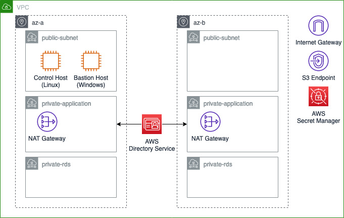

# AWS CDK Infrastructure as Code for Zaloni Arena POC/MVP Prerequisites

This project is meant to automate the deployment of all the prerequsite resources required 
to deploy Zaloni Arena on AWS using AWS CDK in Typescript. The code deploys the resoruces into a new isolated VPC. 



## Getting started

Clone this repository and issue the following commands to bootstrap cdk in your
default aws profile account/region

```console
cd aws-cdk-zaloni-arena
npm install -g yarn
npm install
npx cdk bootstrap --cloudformation-execution-policies \
  arn:aws:iam::aws:policy/AdministratorAccess
```

To install the stack with [this configuration](./config/dev.yaml)

```console
npx cdk deploy dev/aws-cdk-zaloni-arena
```

## CI/CD Pipeline


Create the [AWS CodeCommit](https://aws.amazon.com/codecommit) repository that 
our pipeline will use as source

```console
aws codecommit create-repository --repository-name aws-cdk-zaloni-arena
```

Create a local branch and commit it to the AWS Code Commit repository

```console
pip3 install git-remote-codecommit
git remote add pipeline codecommit://aws-cdk-zaloni-arena
git checkout -b pipeline
git add  cdk.context.json
git commit -m"added cdk context file"
git push pipeline pipeline 
```

Install the pipeline stack

```console
npx cdk deploy --require-approval never
```

After the pipeline stack has been created, the pipeline itself will automatically 
be triggered but will not install anything as there are no configuration files.
To create a stage for **test** or **prod**

```console
cp ./config/dev.yaml ./config/test.yaml
```
Edit **test.yaml** to suit your setup and, if the stack will be installed in a 
different account or region, you would need to edit the env dictionary with the 
AWS account and region of choice.
In addition you will need to bootstrap cdk in the said account/region

```console
npx cdk bootstrap \
  --profile <test_account_profile> \
  --trust <pipeline_account_no> \
  --cloudformation-execution-policies arn:aws:iam::aws:policy/AdministratorAccess \
  aws://<test_account_no>/<test_region> 
```

And finally commit the **test.yaml** and **cdk.context.json** and push it to the 
pipeline repo

```console
git add ./config/test.yaml cdk.context.json
git commit -m"adding test staging"
git push pipeline pipeline 
```

Wait for the pipeline to be triggered again and the test stack will be created.
Look at each stack outputs in AWS CloudFormation for relevant 
information on how to access the resources created by the stacks.

## Security

See [CONTRIBUTING](CONTRIBUTING.md#security-issue-notifications) for more 
information.

## License

This code is licensed under the MIT-0 License. See the LICENSE file.
